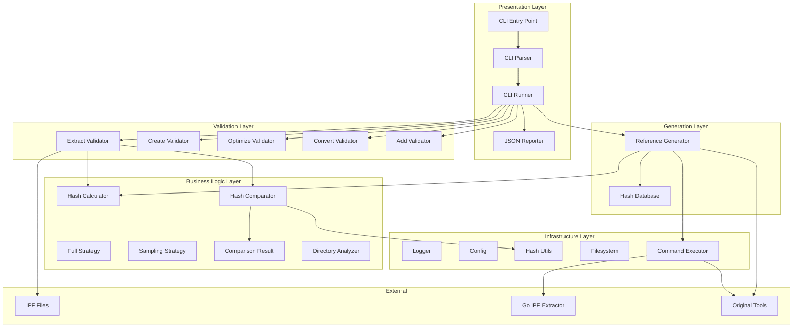
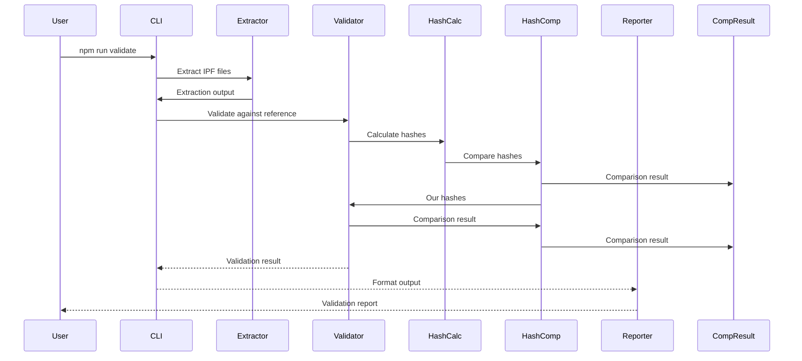
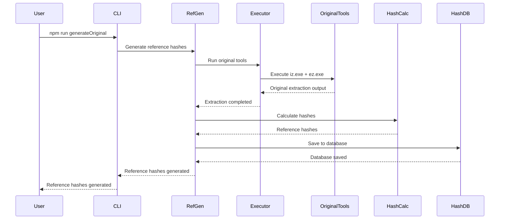

# Testing Framework Architecture

Technical architecture documentation for Granado Espada IPF testing framework.

## Overview

The testing framework is a modular JavaScript application that validates IPF tool implementations against original Windows tools using hash-based comparison. The architecture follows strict separation of concerns with clear layers: infrastructure, business logic, generation, and validation.

## High-Level Architecture



## Module Structure

### Directory Layout

```
testing/
├── src/
│   ├── infrastructure/           # Core utilities (no business logic)
│   │   ├── hash.js            # Pure hash functions
│   │   ├── filesystem.js      # File system operations
│   │   ├── executor.js        # Command execution
│   │   ├── logger.js          # Configurable logging
│   │   └── config.js          # Configuration
│   ├── business/              # Business logic
│   │   ├── analysis/          # Directory structure analysis
│   │   │   └── directory-analyzer.js
│   │   ├── hashing/           # Hash calculation strategies
│   │   │   ├── hash-calculator.js
│   │   │   └── strategies/
│   │   │       ├── full-strategy.js
│   │   │       └── sampling-strategy.js
│   │   ├── comparison/        # Hash comparison
│   │   │   ├── hash-comparator.js
│   │   │   └── comparison-result.js
│   │   └── validation/        # Tool validators
│   │       ├── extract-validator.js
│   │       ├── create-validator.js
│   │       ├── optimize-validator.js
│   │       ├── convert-validator.js
│   │       └── add-validator.js
│   ├── generation/            # Reference generation
│   │   ├── hash-database.js
│   │   └── reference-generator.js
│   └── presentation/          # User interface
│       └── reporting/
│           └── json-reporter.js
├── test_files/               # IPF test files
├── test_hashes/              # Reference hash databases
├── cli.js                   # Main entry point
├── package.json              # npm configuration
└── architecture.md           # This file
```

## Layer Responsibilities

### 1. Infrastructure Layer

**Purpose**: Core utilities with no business logic. Reusable across all modules.

#### hash.js (60-80 lines)
- Pure hash calculation functions
- No side effects, deterministic
- Functions:
  - `calculateFileHash(path)` - SHA-256 of file
  - `calculateStringHash(content)` - SHA-256 of string
  - `calculateDirectoryHash(path, strategy)` - Router to strategy

#### filesystem.js (90-110 lines)
- File system abstraction
- All FS operations in one place
- Functions:
  - `ensureDir(path)` - Create directory
  - `removeDir(path)` - Recursive delete
  - `fileExists(path)` - Check existence
  - `readFile(path, encoding)` - Read file
  - `writeFile(path, content, encoding)` - Write file
  - `readJson(path)` - Parse JSON
  - `writeJson(path, data, indent)` - Stringify + write
  - `scanDirectory(path, recursive)` - Get file list
  - `getFileInfo(path)` - File stats
  - `copyFile(src, dest)` - Copy file
  - `moveFile(src, dest)` - Move/rename
  - `removeFile(path)` - Delete file (with ENOENT handling)

#### executor.js (100-120 lines)
- Command execution with timeout
- Cross-platform support
- Functions:
  - `executeCommand(command, args, options)` - Spawn process
  - `executeOriginalTool(toolName, args, workingDir)` - iz.exe/ez.exe
  - `executeOurTool(toolPath, args)` - Our compiled binary

#### logger.js (120-150 lines)
- Centralized logging with console/file output
- Console output uses symbols (✓ ✗ ⚠ ℹ)
- File output uses timestamps only
- Respects log levels (debug, info, warn, error)
- Sinks: console, file, or both
- Class `Logger`:
  - `log(message, level, symbol)` - Core logging with optional symbol
  - `info(message)` - Info with ℹ symbol
  - `success(message)` - Success with ✓ symbol
  - `warn(message)` - Warning with ⚠ symbol
  - `error(message)` - Error with ✗ symbol
  - `debug(message)` - Debug (no symbol, respects level)
  - `plain(message)` - Raw output (no timestamp, respects level as info)
  - `setLevel(level)` - Change level
  - `setSink(sink)` - Change output

#### config.js (80-100 lines)
- Single source of truth for configuration
- Clear PROJECT_ROOT reference
- Configuration:
  - Paths (all derived from PROJECT_ROOT)
  - Hash strategy thresholds
  - Execution timeouts
  - Test file configurations
  - Logging settings

### 2. Business Logic Layer

**Purpose**: Domain-specific logic for hashing, comparison, and validation.

#### analysis/directory-analyzer.js (90-110 lines)
- Directory structure analysis
- Functions:
  - `analyzeDirectory(path)` - Returns {fileCount, totalSize, structure}
  - `countFiles(path)` - Count files recursively
  - `calculateTotalSize(path)` - Sum file sizes
  - `buildManifest(path)` - File tree structure

#### hashing/hash-calculator.js (80-100 lines)
- Strategy pattern for hash calculation
- Class `HashCalculator`:
  - `constructor(strategy)` - Accept strategy
  - `calculate(path)` - Delegate to strategy
  - `getStrategyName()` - Return strategy name

#### hashing/strategies/full-strategy.js (50-70 lines)
- Full file-by-file hashing
- Functions:
  - `hashDirectory(path, fileLimit)` - Hash every file
  - `createManifest(files)` - Build hash manifest
  - `calculateManifestHash(manifest)` - Hash of manifest

#### hashing/strategies/sampling-strategy.js (70-90 lines)
- Representative sampling hashing
- Functions:
  - `sampleFiles(files, config)` - Select 45 samples (15 start + 15 middle + 15 end)
  - `hashSamples(path, samples)` - Hash selected files
  - `estimateTotalSize(samples, totalCount)` - Extrapolate size

#### comparison/hash-comparator.js (120-150 lines)
- Compare hash objects
- Functions:
  - `compareFull(ourHash, refHash)` - Full comparison
  - `compareSamples(ourHash, refHash)` - Sample comparison
  - `detectDifferences(ourHash, refHash)` - File-by-file diff
  - `calculateMatchScore(results)` - 0.0-1.0 score

#### comparison/comparison-result.js (60-80 lines)
- Result data structure
- Class `ComparisonResult`:
  - `isPerfectMatch()` - Boolean check
  - `getDifferences()` - List mismatches
  - `getStatistics()` - Count mismatches, size diff
  - `toJSON()` - Serialized format
  - `getSummary()` - Human-readable summary

### 3. Validation Layer

**Purpose**: Validate specific tool outputs.

#### validation/extract-validator.js (80-100 lines)
- Validate extraction output
- Class `ExtractValidator`:
  - `validate(outputDir, reference)` - Main validation
  - `checkFileStructure(dir, reference)` - Verify structure
  - `validateFileContent(file, reference)` - Hash comparison

#### validation/create-validator.js (60-80 lines)
- Validate IPF creation output (stubbed)
- Class `CreateValidator`:
  - `validate(ipfPath, reference)` - Main validation
  - `checkIPFFormat(ipfPath)` - ZIP structure

#### validation/optimize-validator.js (60-80 lines)
- Validate optimization output (stubbed)
- Class `OptimizeValidator`:
  - `validate(optimizedPath, reference)` - Main validation
  - `checkSizeReduction(original, optimized)` - Verify optimization

#### validation/convert-validator.js (60-80 lines)
- Validate IES conversion output (stubbed)
- Class `ConvertValidator`:
  - `validate(outputDir, reference)` - Main validation
  - `checkXMLStructure(dir)` - Verify format

#### validation/add-validator.js (60-80 lines)
- Validate addition output (stubbed)
- Class `AddValidator`:
  - `validate(modifiedIPF, reference)` - Main validation
  - `checkNewFiles(modifiedIPF)` - Verify files added

### 4. Generation Layer

**Purpose**: Generate reference hash databases.

#### generation/hash-database.js (80-100 lines)
- Hash database CRUD
- Class `HashDatabase`:
  - `constructor(path)` - Load database
  - `getTestFile(key)` - Get test file data
  - `addTestFile(key, data)` - Add/replace entry
  - `save(path)` - Persist to file
  - `validate()` - Check data integrity

#### generation/reference-generator.js (120-150 lines)
- Reference generation orchestration
- Class `ReferenceGenerator`:
  - `generate(testFiles, outputDir)` - Main orchestration
  - `processTestFile(fileKey, config)` - Single file
  - `runOriginalPipeline(fileConfig)` - iz.exe + ez.exe
  - `saveDatabase(hashes, outputDir)` - Write JSON

### 5. Presentation Layer

**Purpose**: User interface and output formatting.

#### reporting/json-reporter.js (60-80 lines)
- JSON report generation
- Class `JsonReporter`:
  - `generateReport(results, metadata)` - Create report object
  - `saveReport(report, path)` - Write to file
  - `mergeReports(reports)` - Combine multiple reports
  - `validateReport(report)` - Check structure

#### cli/cli-parser.js (80-100 lines)
- Argument parsing
- Class `CliParser`:
  - `parse(args)` - Parse argv
  - `validateOptions(options)` - Check required options
  - `showHelp(command)` - Display help text
  - `showGeneralHelp()` - Display general help

#### cli/cli-runner.js (60-80 lines)
- Command dispatch
- Class `CliRunner`:
  - `run(args)` - Main entry point
  - `dispatch(command, options)` - Route to command handler
  - `handleError(error)` - Error handling

#### cli/commands/
Each command file (100-140 lines):
- `execute(options)` - Main command implementation
- `showHelp()` - Command-specific help
- Command-specific logic (validation, generation, extraction, etc.)

## Data Flow

### Validation Flow



### Reference Generation Flow



## Design Patterns

### Strategy Pattern
Used in `hash-calculator.js` to support multiple hashing strategies:

```javascript
const fullStrategy = new FullStrategy();
const samplingStrategy = new SamplingStrategy();

const calculator = new HashCalculator(fullStrategy);
const result = await calculator.calculate('/path/to/dir');

const strategy = calculator.getStrategyName(); // "full" or "sampling"
```

### Command Pattern
Used in CLI commands to encapsulate command logic:

```javascript
const commandHandler = this.commands[parsed.command];
const exitCode = await commandHandler.execute(parsed.options);
```

### Singleton Pattern
Used in `config.js` for single source of configuration:

```javascript
const config = require('../../config');

const hashDBPath = config.EXTRACTION_ORIGINAL_HASHES_PATH;
```

## Error Handling

### Layered Error Handling

1. **Infrastructure Layer**: Low-level errors (file not found, permission denied)
2. **Business Logic Layer**: Domain errors (invalid hash, comparison mismatch)
3. **Validation Layer**: Validation errors (missing files, content mismatch)
4. **Presentation Layer**: User-facing error messages

### Error Propagation

```javascript
try {
    calculateHash(path);
} catch (error) {
    logger.error(`Hash calculation failed: ${error.message}`);
    return { success: false, error: error.message };
}
```

## Testing

### Unit Tests
Low-level utilities only (infrastructure layer):

```javascript
describe('Hash', () => {
    it('should calculate SHA-256 hash', () => {
        const hash = calculateStringHash('test');
        expect(hash).toBe(expectedHash);
    });
});
```

### Integration Tests
End-to-end testing through CLI commands:

```bash
npm test          # Full test suite
npm run validate  # Validate extraction
npm run generate  # Generate reference hashes
```

## Performance Considerations

### Streaming Hashing
Large files are hashed in streams to avoid memory exhaustion:

```javascript
const hash = crypto.createHash('sha256');
const stream = fs.createReadStream(path);
stream.on('data', (data) => hash.update(data));
```

### Parallel Processing
Hash calculation is parallelized for multiple files:

```javascript
const hashPromises = files.map(file => calculateFileHash(file));
const hashes = await Promise.all(hashPromises);
```

### Smart Strategy Selection
Hash strategy is chosen based on file count to optimize performance:

- **≤100 files**: Full hashing (accurate but slower)
- **>100 files**: Sampling (fast but statistically representative)

## Future Enhancements

### Planned Features

1. **Workflow Layer**: Complex orchestration pipelines
2. **Additional Validators**: Create, optimize, convert, add validators
3. **Performance Profiling**: Built-in performance metrics
4. **Parallel Testing**: Concurrent test execution
5. **Docker Support**: Containerized testing environment

### Scalability

The modular architecture allows easy addition of:
- New hash strategies
- New tool validators
- New CLI commands
- New output formats

## Dependencies

### Runtime Dependencies
- Node.js >= 14.0.0
- Go binary (built from `src/golang/`)
- Wine (Linux/Mac only, for original tools)

### Dev Dependencies
- ESLint (code linting)
- Jest (unit testing)

## License

MIT License - See LICENSE file for details.
