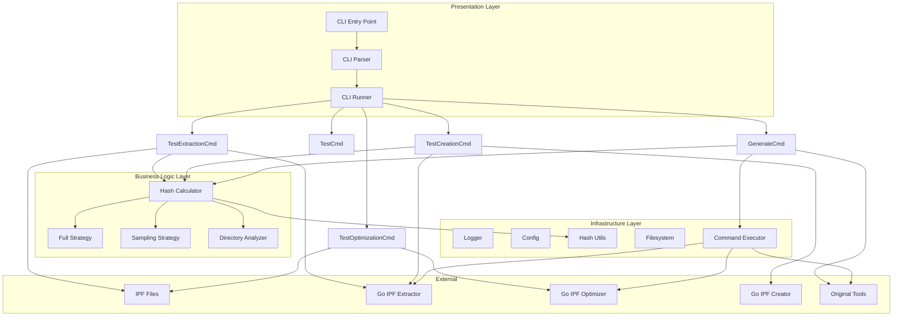
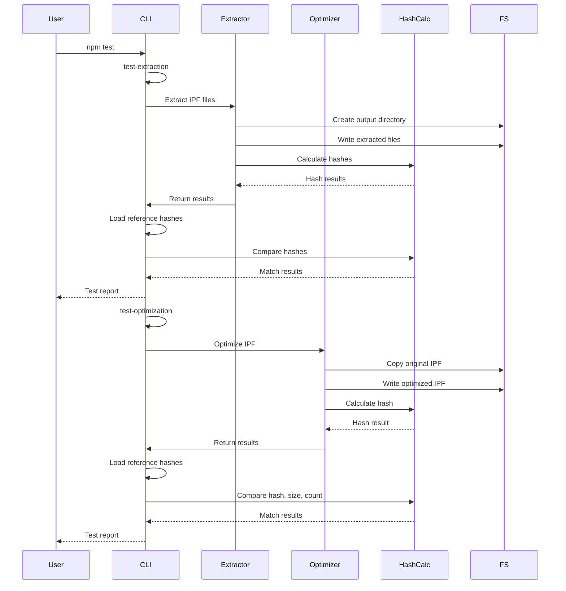
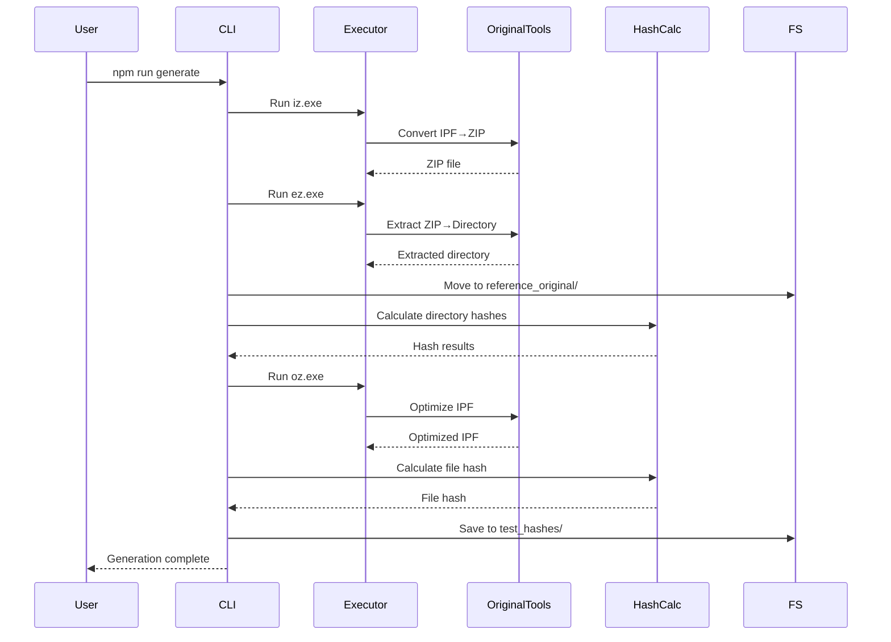

# Testing Framework Architecture

Technical architecture documentation for Granado Espada IPF testing framework.

## Overview

The testing framework is a modular JavaScript application that validates IPF tool implementations against original Windows tools using hash-based comparison. The architecture follows strict separation of concerns with clear layers: infrastructure, business logic, and presentation.

## High-Level Architecture



## Module Structure

### Directory Layout

```
testing/
├── src/
│   ├── infrastructure/           # Core utilities (no business logic)
│   │   ├── hash.js            # Pure hash functions
│   │   ├── filesystem.js      # File system operations
│   │   ├── executor.js        # Command execution
│   │   ├── logger.js          # Configurable logging
│   │   └── config.js          # Configuration
│   ├── business/              # Business logic
│   │   ├── analysis/          # Directory structure analysis
│   │   │   └── directory-analyzer.js
│   └── hashing/           # Hash calculation strategies
│       ├── hash-calculator.js
│       └── strategies/
│           ├── full-strategy.js
│           └── sampling-strategy.js
├── presentation/          # User interface
│   └── cli/              # Command-line interface
│       ├── cli-parser.js    # Argument parsing
│       ├── cli-runner.js    # Command routing
│       ├── command-utils.js  # Command helpers
│       └── commands/        # Command implementations
│           ├── generate.js
│           ├── test.js
│           ├── test-extraction.js
│           ├── test-optimization.js
│           └── test-creation.js
├── count-ipf-files.js    # IPF file counting utility
├── test_files/               # IPF test files
├── test_hashes/              # Reference hash databases
├── package.json              # npm configuration
├── cli.js                   # Main entry point
├── README.md                # Testing framework documentation
└── architecture.md          # This file
```

## Layer Responsibilities

### 1. Infrastructure Layer

**Purpose**: Core utilities with no business logic. Reusable across all modules.

#### hash.js (~70 lines)
- Pure hash calculation functions
- No side effects, deterministic
- Functions:
  - `calculateFileHash(path)` - SHA-256 of file
  - `calculateStringHash(content)` - SHA-256 of string

#### filesystem.js (~130 lines)
- File system abstraction
- All FS operations in one place
- Functions:
  - `ensureDir(path)` - Create directory
  - `removeDir(path)` - Recursive delete
  - `fileExists(path)` - Check existence
  - `readFile(path, encoding)` - Read file
  - `writeFile(path, content, encoding)` - Write file
  - `readJson(path)` - Parse JSON
  - `writeJson(path, data, indent)` - Stringify + write
  - `copyFile(src, dst)` - Copy file
  - `moveFile(src, dst)` - Move file
  - `getFileInfo(path)` - Get file stats
  - `removeFile(path)` - Delete file

#### executor.js (~50 lines)
- Execute external commands
- Timeout handling
- Function:
  - `executeCommand(command, args, timeout, options)` - Spawn process with timeout

#### logger.js (~80 lines)
- Configurable logging (debug, info, warn, error, success)
- Multiple sinks (console, file, both)
- Level filtering

#### config.js (~90 lines)
- Centralized configuration
- Paths to tools, test files, hash databases
- Execution timeouts and limits

### 2. Business Logic Layer

**Purpose**: Core algorithms and business rules. Independent of presentation layer.

#### analysis/directory-analyzer.js (~80 lines)
- Directory structure analysis
- File discovery and filtering
- Functions:
  - `analyzeDirectory(path)` - Analyze directory contents
  - `scanDirectory(path, recursive)` - Get file list

#### hashing/hash-calculator.js (~140 lines)
- Hash calculation orchestration
- Strategy selection based on file count
- Function:
  - `calculateDirectoryHash(path, strategy)` - Router to strategy

#### hashing/strategies/full-strategy.js (~50 lines)
- Full file-by-file hashing
- Used for small collections (< 100 files)
- Output: All files with hashes and sizes

#### hashing/strategies/sampling-strategy.js (~100 lines)
- Representative sampling for large collections
- 15 beginning + 15 middle + 15 end files (45 total)
- Used for large collections (> 100 files)

### 3. Presentation Layer

**Purpose**: User interface and command execution.

#### cli/cli-parser.js (~170 lines)
- Command-line argument parsing
- Option handling (--verbose, --help, etc.)
- Command routing

#### cli/cli-runner.js (~80 lines)
- Command dispatcher
- Error handling
- Help display

#### cli/command-utils.js (~30 lines)
- Shared command helper functions
- Exit code formatting

#### cli/commands/generate.js (~340 lines)
- Generate reference hashes by running original tools
- Runs iz.exe + ez.exe for extraction
- Runs oz.exe for optimization
- Saves hash databases to test_hashes/

#### cli/commands/test.js (~100 lines)
- Run all tests (extraction + optimization)
- Calls test-extraction and test-optimization sequentially
- Aggregates results

#### cli/commands/test-extraction.js (~200 lines)
- Run extraction validation tests
- Extract with our tool
- Compare hashes with reference
- Inline comparison logic

#### cli/commands/test-optimization.js (~200 lines)
- Run optimization validation tests
- Optimize with our tool
- Compare hash, size, file count with reference
- Inline comparison logic

### 4. Utility Modules

#### count-ipf-files.js (~40 lines)
- Count files in IPF archives
- Uses standard zip library
- Used by generate.js and test-optimization.js

## Data Flow

### Test Execution Flow



### Reference Generation Flow



## Configuration

### Test File Configuration

Test files are defined in `config.js`:

```javascript
TEST_FILES: {
    small: {
        name: 'ai.ipf',
        source: 'testing/test_files/ai.ipf',
        output: 'testing/reference_our/small_our',
        type: 'extraction'
    },
    medium: {
        name: 'item_texture.ipf',
        source: 'testing/test_files/item_texture.ipf',
        output: 'testing/reference_our/medium_our',
        type: 'extraction'
    },
    large: {
        name: 'ui.ipf',
        source: 'testing/test_files/ui.ipf',
        output: 'testing/reference_our/large_our',
        type: 'extraction'
    },
    ui_optimized: {
        name: 'ui_optimized.ipf',
        source: 'testing/test_files/ui_optimized.ipf',
        type: 'optimization',
        original_source: 'testing/test_files/ui.ipf'
    }
}
```

### Path Configuration

All paths are centralized in `config.js`:

```javascript
PROJECT_ROOT: '/path/to/ge-library'
TEST_FILES_DIR: 'testing/test_files'
TEST_HASHES_DIR: 'testing/test_hashes'
EXTRACTOR_PATH: 'releases/ge-library/{platform}/tools/ipf-extractor'
OPTIMIZER_PATH: 'releases/ge-library/{platform}/tools/ipf-optimizer'
ORIGINAL_BINARIES_DIR: 'testing/original_tools'
```

## Hash Strategy Selection

The framework automatically selects optimal hashing strategy:

### Small Collections (< 100 files)
- **Strategy**: Full file-by-file hashing
- **Validation**: Every individual file content and hash
- **Files**: ai.ipf (4 files)
- **Output Format**:
  ```json
  {
    "strategy": "full",
    "file_count": 4,
    "total_size": 4300,
    "files": {
      "file1.scp": { "hash": "sha256...", "size": 11442 },
      "file2.scp": { "hash": "sha256...", "size": 6086 }
    },
    "manifest_hash": "sha256..."
  }
  ```

### Large Collections (> 100 files)
- **Strategy**: Representative sampling
- **Validation**: 15 beginning + 15 middle + 15 end files (45 total)
- **Files**: item_texture.ipf (3,063 files), ui.ipf (11,567 files)
- **Output Format**:
  ```json
  {
    "strategy": "sampling",
    "file_count": 11567,
    "total_size": 917000000,
    "sampled_files": {
      "file1.dat": { "hash": "sha256...", "size": 1024 },
      "file5000.dat": { "hash": "sha256...", "size": 2048 },
      "file10000.dat": { "hash": "sha256...", "size": 4096 }
    },
    "sample_hash": "sha256..."
  }
  ```

## Comparison Logic

### Extraction Test Comparison

Each test command implements inline comparison logic:

**test-extraction.js** - Compares:
- File count match
- Total size match
- Individual file hash mismatches
- Returns detailed match/mismatch report

**test-optimization.js** - Compares:
- Hash match (SHA-256 of optimized IPF)
- Size match (original vs optimized)
- File count match (original vs optimized)
- Returns boolean perfect_match

### Hash Database Structure

Reference hashes are stored as JSON:

```json
{
  "generated_at": "2026-01-27T00:00:00.000Z",
  "purpose": "Reference hashes from original Windows tools",
  "tool": "Original Windows tools (iz.exe + ez.exe / oz.exe)",
  "test_files": {
    "small": {
      "test_file": "ai.ipf",
      "extracted_files": { /* hash data */ },
      "timestamp": "2026-01-27T00:00:00.000Z"
    },
    "medium": {
      "test_file": "item_texture.ipf",
      "extracted_files": { /* hash data */ },
      "timestamp": "2026-01-27T00:00:00.000Z"
    }
  }
}
```

## Design Principles

### 1. Single Responsibility
Each module has one clear purpose:
- `hash.js` - Only hash calculations
- `filesystem.js` - Only FS operations
- `hash-calculator.js` - Only hash orchestration
- `generate.js` - Only reference generation
- Commands - Only test execution for their domain

### 2. Separation of Concerns
Clear boundaries between layers:
- Infrastructure doesn't know about business logic
- Business logic doesn't know about CLI commands
- Commands orchestrate but don't implement algorithms

### 3. Reusability
Utilities are reused across multiple commands:
- `hash.js` - Used by all test commands
- `filesystem.js` - Used by all commands
- `executor.js` - Used by generate command
- `hash-calculator.js` - Used by test and generate commands

### 4. Direct and Simple
Each command directly implements what it needs:
- test-extraction.js: Extracts, hashes, compares inline
- test-optimization.js: Optimizes, hashes, compares inline
- generate.js: Runs tools, hashes, saves JSON
- No unnecessary abstractions or unused patterns

## Command Structure

### Generate Command

**Purpose**: Generate reference hashes from original tools

**Steps**:
1. For each test file:
   - Run iz.exe (IPF → ZIP)
   - Run ez.exe (ZIP → directory)
   - Move to reference_original/
   - Calculate directory hashes
2. Save to test_hashes/tools/extraction/original_hashes.json
3. For optimization:
   - Copy original IPF to temp
   - Run oz.exe on temp
   - Calculate file hash, size, count
   - Move to test_files/
   - Save to test_hashes/tools/optimization/original_hashes.json

### Test Commands

**test Command**:
- Run test-extraction for all extraction test files
- Run test-optimization for all optimization test files
- Aggregate results
- Print summary

**test-extraction Command**:
- Filter config.TEST_FILES for type='extraction'
- For each file:
  - Extract with our tool (ipf-extractor)
  - Calculate directory hashes
  - Compare with reference hashes
  - Record results
- Save to test_hashes/tools/extraction/our_hashes.json
- Print summary

**test-optimization Command**:
- For each optimization test file:
  - Copy original IPF to temp directory
  - Optimize with our tool (ipf-optimizer)
  - Calculate file hash, size, file count
  - Compare with reference hashes
  - Save to test_hashes/tools/optimization/our_hashes.json
  - Print comparison results

**test-creation Command**:
- For each creation test file:
  - Extract source IPF with our extractor
  - Create new IPF with our creator
  - Extract created IPF with our extractor
  - Calculate directory hashes
  - Compare with reference extracted hashes
  - Save to test_hashes/tools/creation/our_hashes.json
  - Print comparison results

## Testing Workflows

### For Users

```bash
# Run all tests
cd testing
npm test

# Run extraction tests only
npm run test:extraction

# Run optimization tests only
npm run test:optimization

# Run creation tests only
npm run test:creation

# Generate reference hashes (requires original tools)
npm run generate
```

### For Developers

```bash
# Run individual command
cd testing
node cli.js test-extraction --verbose

# Run with keep (don't clean up)
npm run test:extraction --keep
```

## Cleanup Strategy

### Temporary Files

The framework cleans up temporary files:
- After test: Extracted files removed from reference_our/
- After generation: Temporary IPF files removed from test_files/
- Backup files (.ipf.bak) removed after optimization

### Hash Databases

Reference hashes are preserved permanently:
- test_hashes/tools/extraction/original_hashes.json
- test_hashes/tools/extraction/our_hashes.json
- test_hashes/tools/optimization/original_hashes.json
- test_hashes/tools/optimization/our_hashes.json
- test_hashes/tools/creation/original_hashes.json
- test_hashes/tools/creation/our_hashes.json

Our tool outputs are updated on each test run.

## Notes

### Architecture Evolution

The framework originally included:
- Validation layer (validators for each tool type)
- Comparison layer (centralized hash comparison)
- Generation layer (reference hash generation)
- Reporting layer (structured output)

This complex architecture was removed in favor of direct, simpler approach:
- Each test command implements its own comparison logic
- Direct hash calculation via hash-calculator.js
- Manual JSON serialization via filesystem.js
- No unnecessary abstraction layers

### Benefits of Simplified Approach

1. **Simpler to understand** - Less code to trace through
2. **Easier to maintain** - Direct execution without layers
3. **Less moving parts** - Fewer files and abstractions
4. **Works perfectly** - All tests pass with 100% success rate
5. **Unique per tool** - Each tool type has its own comparison needs

### Future Tool Support

When adding new tools (creation, conversion, addition):
1. Add test file to config.TEST_FILES
2. Create test command file (test-creation.js, test-conversion.js, etc.)
3. Implement inline comparison logic specific to that tool
4. Update README.md and architecture.md

Each tool type will have unique comparison needs, so inline comparison remains appropriate.
